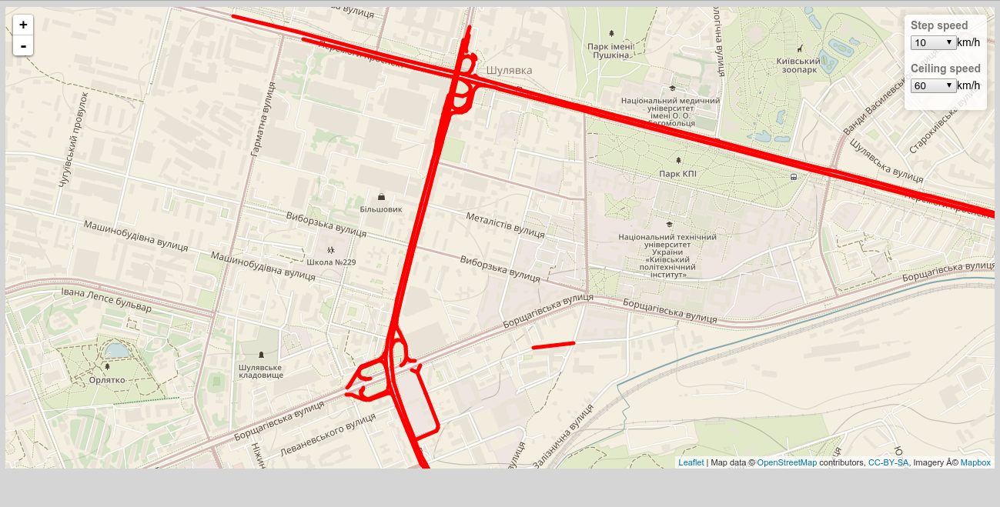

# map_graph
Use leaflet.js и node.js

main file: index.js 
port: localhost:8080/ 
map logic: map.js 
dbconnect: db.js 

SQLquery:
"select id,(select concat_ws('/',lat,lon) from nodes_test where id=srcid) as latlon1,(select concat_ws('/',lat,lon) from nodes_test where id=trgid) as latlon2,speed from edges_test" 

